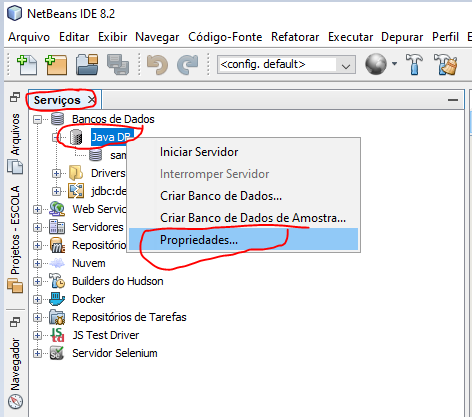
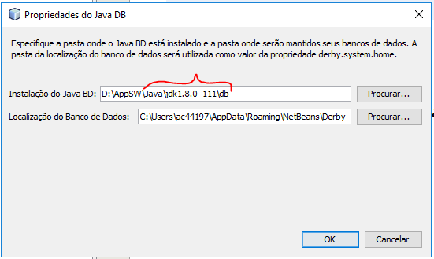
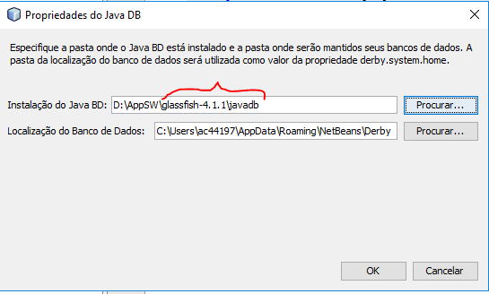
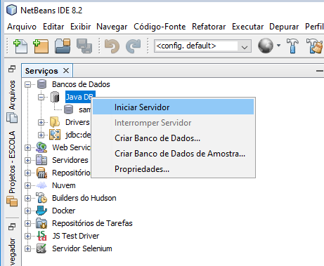
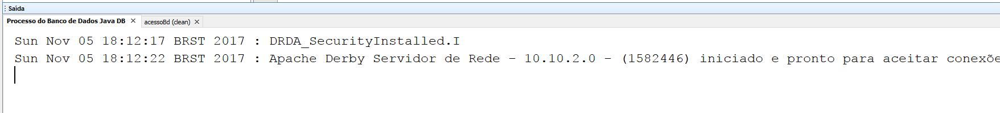
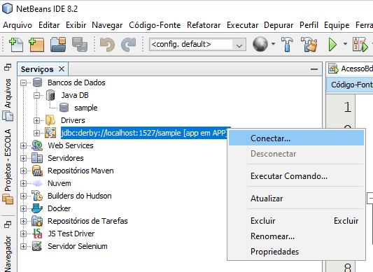

# Aula 012 - Acessando banco de dados

## Criando um projeto de acesso ao BD

### Configurando BD - JavaDB

Caso seu javaDB não esteja funcionando reconfigure-o conforme abaixo:

#### Acessando propriedades

#### Retirando o apontamento do diretório JDK

#### Reapontando para o diretório do glassfish

### Executando o BD - JavaDB

Executando o servidor

#### Iniciando o servidor JavaDB

#### Verificando que o servidor foi executado corretamente

### Testando a conexão com o BD

Testando a conexão com o BD

#### Conectando ao banco de dados

#### Testando a conexão executando uma consulta no banco de dados (TABELA **CITY**)

 - [Bancos de dados e JDBC](https://www.caelum.com.br/apostila-java-web/bancos-de-dados-e-jdbc/)
 - [Core J2EE Patterns - Data Access Object](http://www.oracle.com/technetwork/java/dataaccessobject-138824.html)
 - [Introdução ao pattern DAO](http://javafree.uol.com.br/artigo/871452/Introducao-ao-pattern-DAO.html)
 
