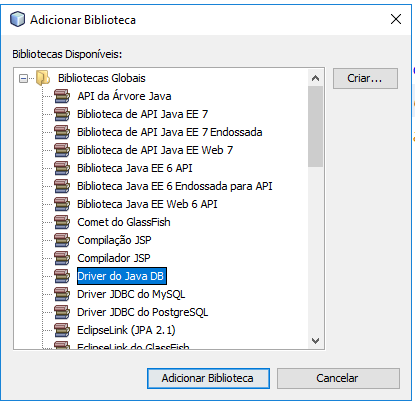

# Aula 012 - Acessando banco de dados

## Criando um projeto de acesso ao BD

### Configurando BD - JavaDB

Caso seu javaDB não esteja funcionando reconfigure-o conforme abaixo:

#### Acessando propriedades

#### Retirando o apontamento do diretório JDK

#### Reapontando para o diretório do glassfish


### Executando o BD - JavaDB

Executando o servidor

#### Iniciando o servidor JavaDB

#### Verificando que o servidor foi executado corretamente


### Testando a conexão com o BD

Testando a conexão com o BD

#### Conectando ao banco de dados

#### Testando a conexão executando uma consulta no banco de dados (COLUNA **CITY** DA TABELA **CUSTOMER**)


### Conectando ao banco de dados utilizando uma aplicação Java

Para conectarmos ao BD utilizando uma aplicação Java precisamos primeiro saber a ***URL*** de conexão com o banco de dados. Esta ***URL*** será utilizada dentro do programa em Java.

O formato da string de conexão será normalmente ```jdbc:<sgbd>://<ip>/<nome_do_banco>```

#### Onde pegar a URL de conexão com o BD

#### Copie a string de conexão para o banco de dados


Esta será a url de conexão ```jdbc:derby://localhost:1527/sample```, provavelmente sa sua deverá ser a mesma. Ela deverá ser utilizada dentro da aplicação em Java.

#### Criando a aplicação Java

Crie um projeto do tipo **Aplicação Java** chamado **acessoDb** e detro do método ```main``` da classe principal  digite o código a seguir:

```java
Connection conexao = DriverManager.getConnection(
		"jdbc:derby://localhost:1527/sample");
System.out.println("Conectado!");
conexao.close();
```

Ajustes serão necessários para que este projeto compile. Você deverá adicionar adequadamente os **imports** e incluir o **throws** por causa do tratamento de exceção.

Compile o projeto e executar para testar.

#### 1º Erro ao tentar executar - falta de biblioteca (driver para o Java acessar o BD)


#### Adicionando a biblioteca no projeto Java
##### Clicar sobre as bibilitecas do projeto e selecionar adicionar

##### Selecionar na caixa Driver do JavaDB e clicar ok


Compile novamente o projeto e execute para testar.

#### 2º Erro ao tentar executar - autenticação - usuário e senha


#### Ajuste o código Java com usuário e senha

Crie um projeto do tipo **Aplicação Java** chamado **acessoDb** e detro do método ```main``` da classe principal  digite o código a seguir:

```java
Connection conexao = DriverManager.getConnection(
		"jdbc:derby://localhost:1527/sample", "app", "app");
```

Compile o projeto e executar para testar.

#### 3º tentativa de executar - contectado!


#### Ajuste o código Java para selecionar dados da tabela

Agora vamos ajustar o método main e selecionar os dados de uma tabela:

```java
    public static void main(String[] args) throws SQLException {
        Connection conexao = DriverManager.getConnection(
                "jdbc:derby://localhost:1527/sample", "app", "app");
        System.out.println("Conectado!");

        PreparedStatement stmt = conexao.prepareStatement("select city from customer");

        // executa um select
        ResultSet rs = stmt.executeQuery();

        // itera no ResultSet
        while (rs.next()) {
            String cidade = rs.getString("city");
            System.out.println(cidade);
        }

        rs.close();
        stmt.close();

        conexao.close();
    }
```

Compile o projeto e executar para testar.

As seguintes cidades serão apresentadas:

```
Fort Lauderdale
Miami
Houston
Alanta
San Mateo
San Jose
Santa Clara
Redwood City
Dearborn
Dearborn
Detroit
New York
New York
```

Brinque com o select e teste as funções que você está utilizando nesta aplicação.

Bons estudos.

## Links

Os seguintes links abaixo serão úteis para você estudar sobre o tema de acesso ao BD

 - [Bancos de dados e JDBC](https://www.caelum.com.br/apostila-java-web/bancos-de-dados-e-jdbc/)
 - [Core J2EE Patterns - Data Access Object](http://www.oracle.com/technetwork/java/dataaccessobject-138824.html)
 - [Introdução ao pattern DAO](http://javafree.uol.com.br/artigo/871452/Introducao-ao-pattern-DAO.html)
 
