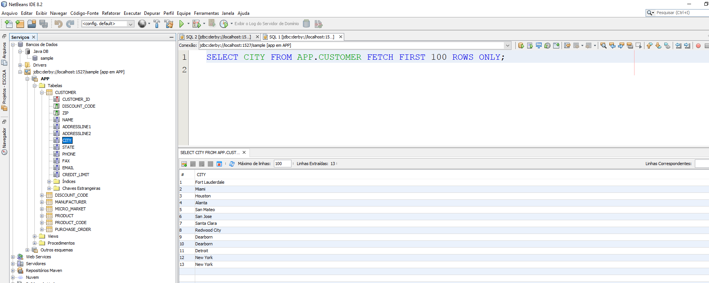
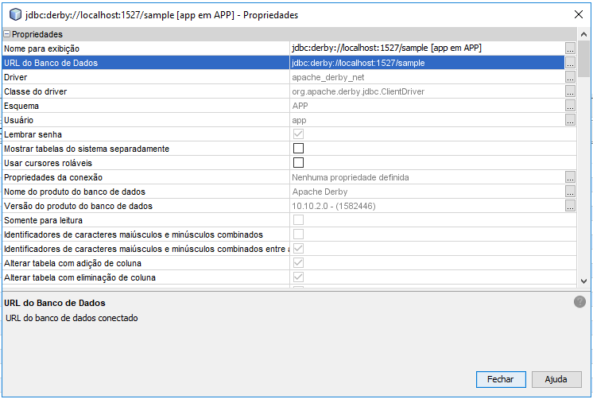

# Aula 012 - Acessando banco de dados

## Criando um projeto de acesso ao BD

### Configurando BD - JavaDB

Caso seu javaDB não esteja funcionando reconfigure-o conforme abaixo:

#### Acessando propriedades

#### Retirando o apontamento do diretório JDK

#### Reapontando para o diretório do glassfish


### Executando o BD - JavaDB

Executando o servidor

#### Iniciando o servidor JavaDB

#### Verificando que o servidor foi executado corretamente


### Testando a conexão com o BD

Testando a conexão com o BD

#### Conectando ao banco de dados

#### Testando a conexão executando uma consulta no banco de dados (TABELA **CITY**)



### Conectando ao banco de dados utilizando uma aplicação Java

Para conectarmos ao BD utilizando uma aplicação Java precisamos primeiro saber a ***URL*** de conexão com o banco de dados. Esta ***URL*** será utilizada dentro do programa em Java.

O formato da string de conexão será normalmente ```jdbc:<sgbd>://<ip>/<nome_do_banco>```

#### Onde pegar a URL de conexão com o BD

#### Copie a string de conexão para o banco de dados



 - [Bancos de dados e JDBC](https://www.caelum.com.br/apostila-java-web/bancos-de-dados-e-jdbc/)
 - [Core J2EE Patterns - Data Access Object](http://www.oracle.com/technetwork/java/dataaccessobject-138824.html)
 - [Introdução ao pattern DAO](http://javafree.uol.com.br/artigo/871452/Introducao-ao-pattern-DAO.html)
 
